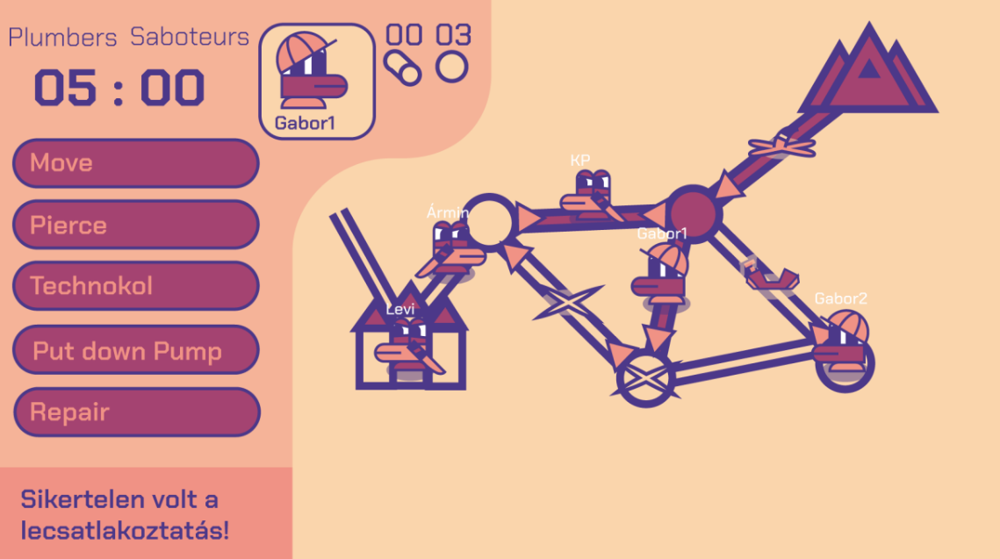

This software is subject to the course *Software Project Lab (2023)*.

The original task was about creating a Desktop Application that runs a turn based game.
The game is set out to be in the Drukmacorian desert, where saboteurs and plumbers play it out on the tunnels of the local sewer network.
The goal of the saboteurs is to cut out the water supply of the cisterns as the plumbers try to undermine  their efforts.
The winner is determined by the amount of water that gets across the system as the game progresses.

The source code can be found in package `macaroni`, which should also be the object of any revision or modification.
