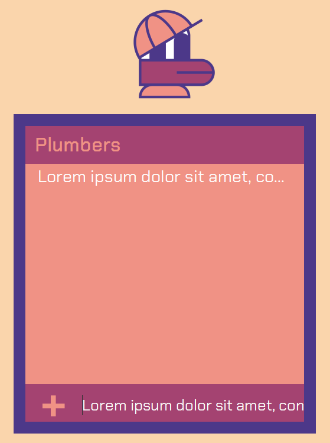

= Manual UI

Manual UI testing is essential for modern applications. User experience and interface presentation are crucial factors when choosing applications among dozens of similar options available to users.

Running the application was the first test, during which we needed to identify UI issues such as disallowed or unclear instructions and ambiguous user interactions.

After the initial testing, we discovered 5 major issues that needed fixing.

== Data type error

Input values were added to a list without validation, with no restrictions on characters. To fix this, we updated the function that handles input parameters to only accept allowed names. The updated function restricts inputs to only include lowercase and uppercase letters (A-Z) and numbers, excluding whitespace.

== Field widths

There were no restrictions on the length of input values (player name), allowing names of any length to be added to the player list. To fix this, we introduced an additional check to ensure that player names can be a maximum of 10 characters long.

== Navigational elements

During application runtime, there was no option to exit because it used full-screen mode without an exit or close button. To implement an exit option, we created a CloseButton class, accessible from the main menu and during gameplay, allowing the application to be closed at any time.

== Error logging

The application did not properly log information or errors. To fix this, we introduced Loggers using the _java.util.logging.Logger_ class, which logs all significant events. Several classes were modified to incorporate this logging functionality.

== Menu items

In the main menu, the _Start_ button was always clickable, even when no map was selected or there weren't enough players. Instructions for the user were unclear about what needed to be completed to start the game. To improve clarity in user interaction, the _Start_ button in the main menu is now only clickable when the conditions required to start the game are met (map selected, sufficient players).

== Summary

The user interface is a critical aspect of the application. In our application, there were no security risks, and the goal was merely to enhance the user experience. Finding the issues is easy, but often it is challenging to determine how to fix them.